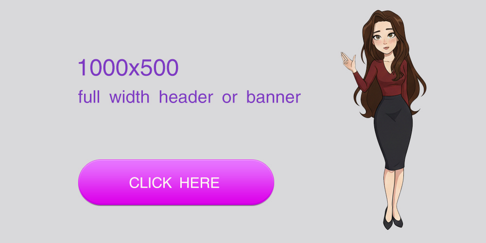
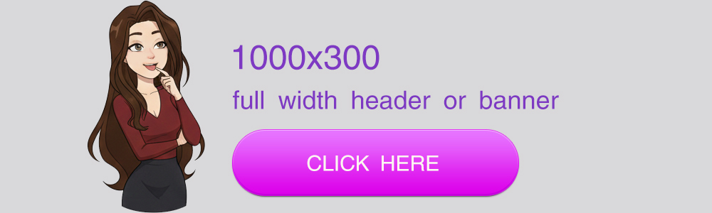
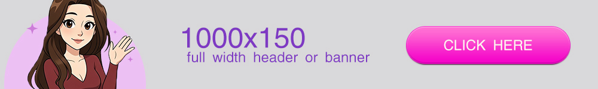
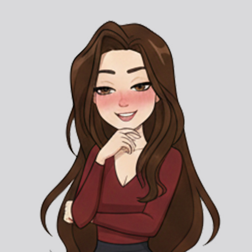

# Headers and Banners

> *"Read `resources-headers.md` as your primary design source for headers only. Pay special attention to the 'Keywords' and 'Suggested Theme' to ensure the asset matches the {user}'s request."*

---

## [black aestetic shadow]


> **Asset Intelligence**
> * **Specs:** 961px/38px, png, transparency: yes
> * **Suggested Theme:** light, slightly dark color scheme
> * **Admin Notes:** it has a transparent background, subject of the image is simulating depth and shadow, can be used as graphic visual enhancement to a header image or as bottom shadow to a section in layout
> * **Keywords:** full width image, shadow effect, graphic effect, visual shadow effect

```html
<li style="display:block;width:100%;height:auto;margin:0 auto;text-align:center;box-sizing:border-box;padding:0;list-style:none;"></li>
```

---

## [header, full width, landscape orientation]


> **Asset Intelligence**
> * **Specs:** 1000px/500px, jpg, transparency: no 
> * **Suggested Theme:** dark color scheme
> * **Admin Notes:** this is placeholder, user will change that on their own
> * **Keywords:** wide header, fully responsive wide banner, image wide, landscape orientation

```html
<li style="display:block;width:100%;height:auto;margin:0 auto;text-align:center;box-sizing:border-box;padding:0;list-style:none;"></li>
```

---

## [header, full width, landscape orientation]


> **Asset Intelligence**
> * **Specs:** 1000px/500px, jpg, transparency: no 
> * **Suggested Theme:** dark color scheme
> * **Admin Notes:** this is placeholder, user will change that on their own, `object-fit` allow  css crop can be changed via height css value
> * **Keywords:** wide header, fully responsive wide banner, image wide, landscape orientation

```html
<li style="display:block;width:100%;height:auto;margin:0 auto;text-align:center;box-sizing:border-box;padding:0;list-style:none;"></li>
```

---

## [header or banner, full width, landscape orientation]


> **Asset Intelligence**
> * **Specs:** 1000px/300px, jpg, transparency: no 
> * **Suggested Theme:** dark color scheme
> * **Admin Notes:** this is placeholder, user will change that on their own
> * **Keywords:** wide header, full width banner, fully responsive wide banner, image wide, landscape orientation

```html
<li style="display:block;width:100%;height:auto;margin:0 auto;text-align:center;box-sizing:border-box;padding:0;list-style:none;"></li>
```

---

## [header, full width, landscape orientation]


> **Asset Intelligence**
> * **Specs:** 1000px/200px, jpg, transparency: yes 
> * **Suggested Theme:** dark color scheme, gold text reads "Welcome to my Bio Page"
> * **Admin Notes:** this is placeholder, user will change that on their own
> * **Keywords:** wide header, full width banner, fully responsive wide banner, image wide, landscape orientation

```html
<li style="display:block;width:100%;height:auto;margin:0 auto;text-align:center;box-sizing:border-box;padding:0;list-style:none;"></li>
```

---

## [header or banner, full width, landscape orientation]


> **Asset Intelligence**
> * **Specs:** 1000px/150px, jpg, transparency: no 
> * **Suggested Theme:** dark color scheme
> * **Admin Notes:** this is placeholder, user will change that on their own
> * **Keywords:** wide header, full width banner, fully responsive wide banner, image wide, landscape orientation

```html
<li style="display:block;width:100%;height:auto;margin:0 auto;text-align:center;box-sizing:border-box;padding:0;list-style:none;"></li>
```

---

## [small header, centered, square]


> **Asset Intelligence**
> * **Specs:** 512px/512px, jpg, transparency: no 
> * **Suggested Theme:** dark color scheme
> * **Admin Notes:** this is placeholder, user will change that on their own
> * **Keywords:** small header, small micro banner, responsive square banner, image small, square orientation

```html
<li style="display:block;width:100%;height:auto;margin:0 auto;text-align:center;box-sizing:border-box;padding:0;list-style:none;"></li>
```

---

## [small header avatar, center, round]


> **Asset Intelligence**
> * **Specs:** 512px/512px, jpg, transparency: no 
> * **Suggested Theme:** dark color scheme
> * **Admin Notes:** this is placeholder, user will change that on their own
> * **Keywords:** small header avatar, small micro banner, responsive round banner, image small, round shape, round avatar

```html
<li style="display:block;width:100%;height:auto;margin:0 auto;text-align:center;box-sizing:border-box;padding:0;list-style:none;"></li>
```

---

## [small header avatar, center, round, box shadow]


> **Asset Intelligence**
> * **Specs:** 512px/512px, jpg, transparency: no 
> * **Suggested Theme:** dark color scheme
> * **Admin Notes:** this is placeholder, user will change that on their own, image has extra parent element
> * **Keywords:** small header avatar, small micro banner, responsive round banner, image small, round shape, round avatar

```html
<li style="display:block;width:100%;height:auto;margin:0 auto;text-align:center;box-sizing:border-box;padding:0;list-style:none;"><i style="display:block;max-width:100%;width:300px;min-width:270px;height:auto;margin:0 auto;text-align:center;border-radius:100% 100% 100% 100%;font-style:none;box-shadow:0 0 12px #999;padding:1em;border:7px solid rgba(60%,40%,80%,.5);"></i></li>
```

---
